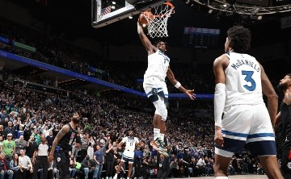

# 🏀 Introducción al Básquet

El básquetbol es un deporte dinámico, estratégico y apasionante. Surgió en 1891, inventado por **James Naismith** como una forma de mantener activos a sus estudiantes durante el invierno.

##  Fuentes

- [Historia del básquet (Wikipedia)](https://es.wikipedia.org/wiki/Baloncesto)
- [FIBA - Federación Internacional](https://www.fiba.basketball)
- [NBA - Sitio oficial](https://www.nba.com)
- [Canal de YouTube de la NBA](https://www.youtube.com/user/NBA)
- [Página de la CABB (Argentina)](https://www.argentina.basketball/)

---

# 🧠 Reglas básicas del juego

El básquet se juega con dos equipos de 5 jugadores en cancha. Gana el que más puntos anote.

###  Puntos por jugada

- Tiro dentro del área: **2 puntos**
- Tiro desde fuera del arco: **3 puntos**
- Tiro libre: **1 punto**

###  Faltas comunes

1. Falta personal
2. Falta técnica
3. Doble dribbling
4. Pasos
5. Zona

---

#  Posiciones en la cancha

Cada jugador cumple una función táctica específica. Estas son las cinco posiciones básicas:

1. Base (Point Guard)
2. Escolta (Shooting Guard)
3. Alero (Small Forward)
4. Ala-Pívot (Power Forward)
5. Pívot (Center)

---

#  La Generación Dorada

Argentina vivió su momento de gloria en 2004, cuando la Selección Nacional ganó el oro olímpico en Atenas. Jugadores como **Manu Ginóbili**, **Luis Scola** y **Andrés Nocioni** marcaron historia.

- Ganaron a EE. UU. en semifinales
- Vencieron a Italia en la final
- Dejaron un legado que inspiró a nuevas generaciones

---

