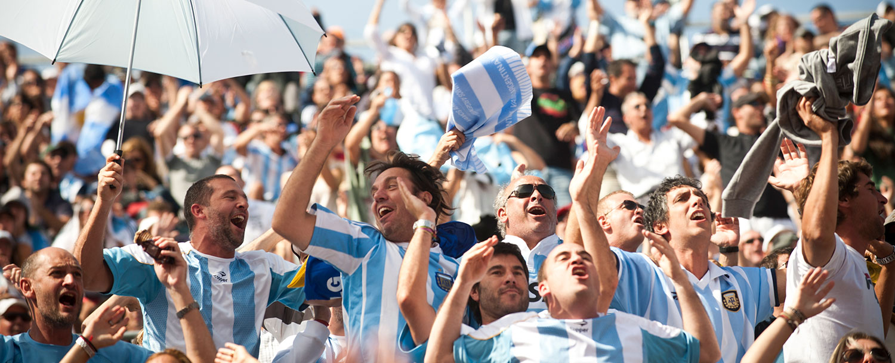
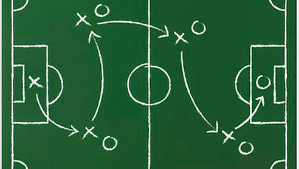

#  La Pasión Inigualable del Fútbol
El fútbol, más que un simple deporte, es un fenómeno cultural global que despierta pasiones intensas y une a personas de todos los rincones del planeta. Su sencillez aparente esconde una complejidad táctica y emocional que lo convierte en un espectáculo fascinante. Desde los barrios humildes hasta los estadios más imponentes, el fútbol teje historias de superación, rivalidad y gloria que perduran en la memoria colectiva.

##  La Evolución Táctica del Juego
A lo largo de su historia, el fútbol ha experimentado una constante evolución en sus estrategias y formaciones. Desde el clásico 4-4-2 hasta las propuestas más innovadoras con carrileros y falsos nueves, los directores técnicos han buscado incansablemente la fórmula para alcanzar la victoria. Esta búsqueda incesante ha enriquecido el juego, ofreciendo una diversidad de estilos que mantienen a los aficionados al borde del asiento.

-   **Algunas formaciones clásicas:**
    -   4-4-2
    -   4-3-3
    -   3-5-2

- **Tendencias tácticas actuales:**

	-   Presión alta y recuperación rápida
	-   Juego de posesión elaborado
	-   Transiciones rápidas ataque-defensa

## El Impacto Social y Económico del Fútbol
El fútbol trasciende las fronteras del campo de juego para convertirse en un motor de desarrollo social y económico. Los clubes generan empleo, impulsan el turismo y fomentan la inversión en infraestructura. Además, el deporte rey tiene el poder de inspirar a jóvenes, promover valores como el trabajo en equipo y la disciplina, y brindar momentos de alegría y esperanza a comunidades enteras.

## Los Ídolos que Marcaron una Era

A lo largo de la historia del fútbol, han surgido figuraslegendarias que han dejado una huella imborrable en el deporte. Jugadores con habilidades excepcionales, liderazgo carismático y una conexión especial con el público se convierten en símbolos de sus equipos y países, inspirando a generaciones de futbolistas y aficionados.

- 1.  Pelé
- 2.  Diego Maradona
- 3.  Lionel Messi
- 4.  Cristiano Ronaldo
- 5.  Johan Cruyff

## Fuentes
-   **FIFA:** https://www.fifa.com/
-   **UEFA:** https://www.uefa.com/
-   **CONMEBOL:** https://www.conmebol.com/
-   **Historia del Fútbol:** https://es.wikipedia.org/wiki/Historia_del_f%C3%BAtbol
- **Tácticas de Fútbol:** https://es.wikipedia.org/wiki/T%C3%A1cticas_de_f%C3%BAtbol