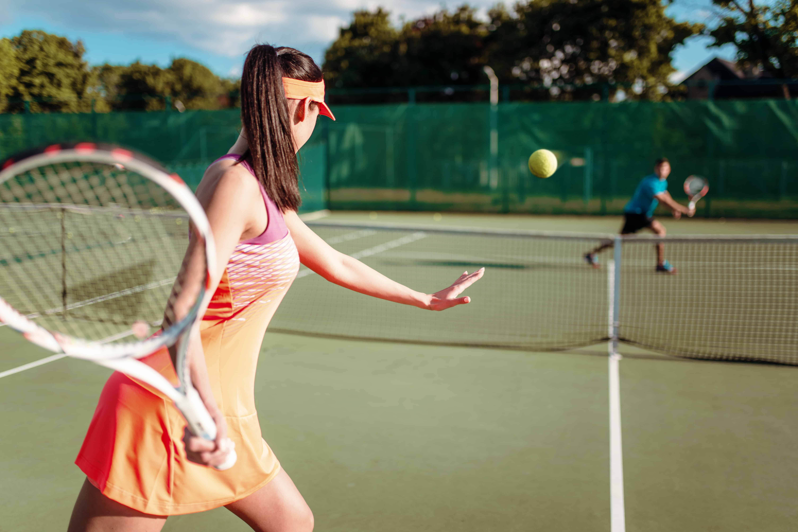
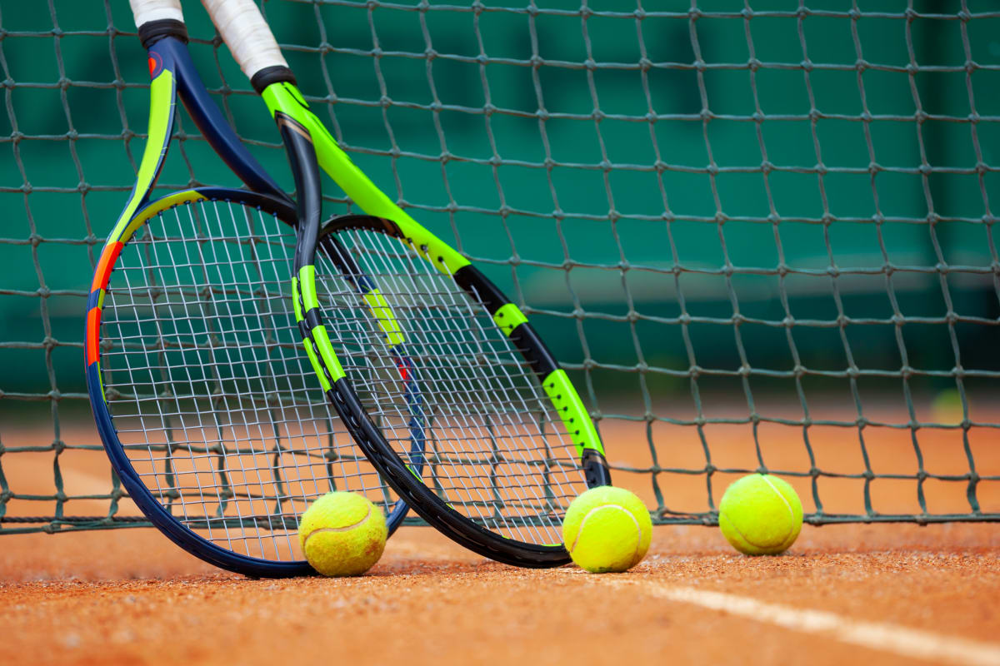
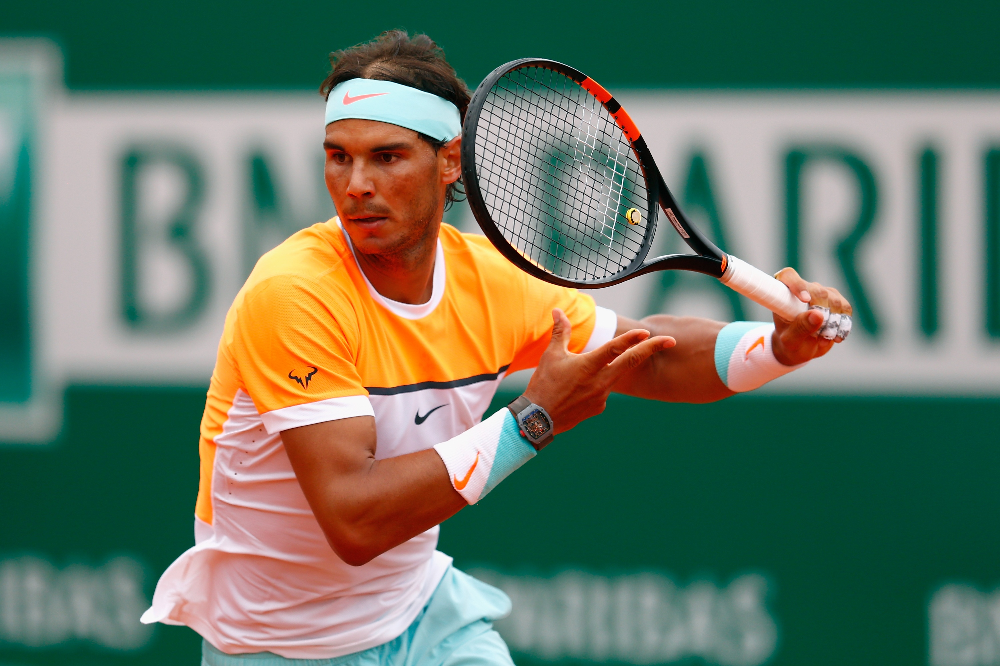

# Deportes

# El mejor juego que existe

# El mas emocionante

# El mas emocionante

# Tenis

1. Como jugar al tenis

**Lo primero que debes saber es que el tenis es un deporte de raquetas**
*Tenis* es un deporte de raquetas que se juega en una cancha dividida en dos partes por una red.
Se juega con una pelota de *tenis* y dos raquetas.
Se puede jugar de forma individual o en parejas.

2. Links

[Tennis](https://www.tennis.com/)

[ATP](https://www.atptour.com/)

[WTA](https://www.wtatennis.com/)

[ITF](https://www.itftennis.com/)

[Tennis Warehouse](https://www.tennis-warehouse.com/)
